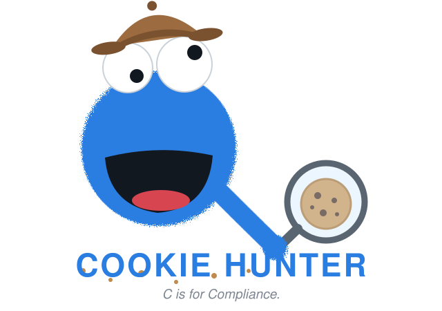

<p align="center">
  
</p>

# Cookie Hunter

Console app that verifies a Cookiebot-equipped site actually blocks trackers before consent.
Every check has an ID (S1–S7, C1–C4, R1–R3, D1–D3, K1, A1–A4); the Phases section below
says what each group covers, and `skill/SKILL.md` explains every ID and what a FAIL means.

## Install

Grab a prebuilt binary from [GitHub Releases](https://github.com/pipejesus/cookie-hunter/releases)
(static, no dependencies — unzip and run), or build from source with `go build` (needs Go).

The browser phases (2–3) need Chrome or Chromium on `PATH`. Without it you can still
run `-static-only` scans.

## Quick start

```
cookie-hunter init https://example.com                      # 1. detect settings → example.com.json
cookie-hunter scan -config example.com.json https://example.com/   # 2. scan using that config
```

The scan prints a pass/fail matrix per URL and exits non-zero if any pre-consent check
failed — ready for CI. You can scan without a config too, but then the checklist checks
(C1–C4) are skipped and unknown cookies aren't matched against an allowlist.

## Usage

```
cookie-hunter init https://example.com                  # generate example.com.json (cbid, region, allowlist)
cookie-hunter install-skill                             # teach AI agents (Claude Code) to drive this tool
cookie-hunter scan https://example.com/page/            # single URL
cookie-hunter scan url1 url2 url3                       # multiple URLs
cookie-hunter scan -config example.com.json url1        # with site config (recommended)
cookie-hunter scan -sitemap https://example.com/sitemap_index.xml   # Yoast sitemap mode
```

Flags:

```
-config file.json   site config (domain, cbid, region, trackerHosts, embedHosts, cookie allowlist, UA)
-sitemap URL        Yoast sitemap_index.xml — expands sub-sitemaps, samples -limit URLs from each
-limit N            URLs sampled per sub-sitemap (default 10)
-static-only        phases 0–1 only (no browser) — cheap, safe for hundreds of URLs
-consent            enable phase 3: submits a REAL consent (logged in the client's Cookiebot account!)
-headed             show the Chrome window (default: headless — same real Chrome, just not painted)
-json               machine-readable output instead of the human matrix
-out dir            snapshot dir (default snapshots/<domain>/<timestamp>/)
```

`init` detects the mechanical settings from the page source (domain, cbid from `data-cbid`
or the uc.js query, region from the consent host) and seeds the cookie allowlist with
well-known session essentials. Extending the allowlist beyond that is a deliberate human
decision: unknown pre-consent cookies fail K1 until you review and allowlist them.
Keep configs with cbids out of shared repos.

Default run = phases 0 (static HTML), 1 (auto-block checklist), 2 (headless Chrome, pre-consent).
Phase 3 (post-consent restore) only with `-consent`. Exit code is non-zero when any pre-consent
check fails on any URL.

## Phases

0. **Static** — fetch raw HTML, checks S1–S7 (Cookiebot tag, GTM, live vs gated embeds, hostile inline scripts, third-party images).
1. **Checklist** — fetch the domain's `configuration.js` auto-block checklist, checks C1–C4 (incl. drift vs previous snapshot).
2. **Runtime pre-consent** — real Chrome, fresh profile, no consent given, 6 s observation: network (R1–R3), DOM (D1–D3), cookie jar (K1).
3. **Runtime post-consent** (`-consent`) — accept all via `Cookiebot.submitCustomConsent`, verify restore (A1–A4).

Snapshots (raw HTML, configuration.js, network log, results.json) land in the run's `-out` dir;
diffing two run dirs is the before/after report.

## Agent skill

`skill/SKILL.md` is a guide for AI coding agents: workflow, a check-ID reference with
"what to tell the user on FAIL", and hard rules (notably: never `-consent` against
production without explicit user approval). It is embedded in the binary at build time;
`cookie-hunter install-skill` auto-detects the agents on the machine and installs for each:

- **Claude Code** → `~/.claude/skills/cookie-hunter/SKILL.md`
- **Codex** → managed block in `~/.codex/AGENTS.md`
- **opencode** → managed block in `~/.config/opencode/AGENTS.md`

AGENTS.md blocks are marker-delimited: re-installs update them in place and never touch
surrounding content. Force a target with `-agent claude|codex|opencode|all`, or install
the Claude-style skill to a custom skills directory with `-dir`.

## Build & test

```
go build          # requires Go; Chrome/Chromium on PATH for phase 2–3
go test ./...     # runtime integration test skips itself when Chrome is absent
```
